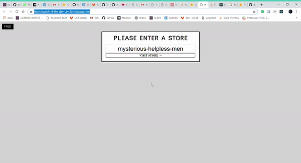

# Catch Of The Day

Check it out here -> [Website](https://catch-of-the-day-tam.firebaseapp.com/). 🐟 🐟 🐟

## OVERVIEW
  
**“Catch of the Day”** — a real-time app for a trendy seafood market where price and quantity available are variable and can change at a moment's notice. 
The Users have their own login credentials through Github or Facebook and they can manage their's account inventory. The Users have the abilities to edit their stocks such as: name, pricing, ...

*Created from Wes Bos's React for Beginners course.*


#### Screenshot:



### Technologies use:
<li>React for building user interfaces 
<li>Firebase provides a realtime database and backend as a service.
<li>Stylus: Flexible and fast modular CSS preprocessor built on top of Rework 


________________________________________________________


### And coding style

**Component and Props**

https://reactjs.org/docs/components-and-props.html (details)

```
return (
          <div className="inventory">
          <h2>Inventory</h2>
          {logout}
          {Object.keys(this.props.fishes).map(key => 
          <EditFishForm 
            key={key} 
            index={key} 
            fish={this.props.fishes[key]} 
            updateFish={this.props.updateFish}
            deleteFish={this.props.deleteFish}
          />)}

          <AddfishForm addFish={this.props.addFish} />
          <button onClick={this.props.loadSampleFishes}>Load Sample Fishes</button>

          </div>
```

## Deployment
🔥🔥🔥
_**Firebase Deploy** - For example and usage, please refer to this page: https://thewebsitedev.com/deploying-react-app-firebase/._


### Thank you for reviewing! 😃 ❤️

